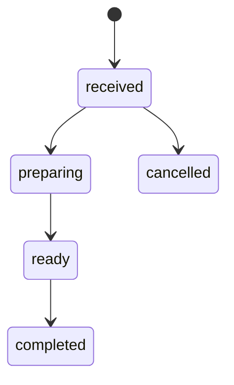

# Dispatch Kitchen

An inventory-aware pickup ordering demo with a React storefront, kitchen queue, and transactional SQLite API. It turns a basic food-listing exercise into a complete order lifecycle.

## Run locally

Requires **Node.js 24+**.

```sh
npm ci
npm run build
npm start
# http://127.0.0.1:3103
```

Six demo dishes start with 12 portions each on the first database open. Data persists in `data/kitchen.db`. Development: run `npm run server` and `npm run dev` in two terminals. `npm test` runs the automated API/store checks. Alternatively, `docker compose up --build` packages both UI and API.

## Try the workflow

1. Add dishes, enter a demo pickup name, and place an order.
2. Switch to **Kitchen queue**. Move the ticket from received to preparing, ready, then completed.
3. Place another order and cancel it while received. Its reserved inventory returns to the menu.
4. Watch the receipt refresh every 10 seconds. Completed and cancelled tickets remain in history.

No payment is processed. All prices are USD demo prices; tax, delivery, dietary guarantees, and actual fulfillment are outside the project.

## Engineering features

- Server-owned prices represented as integer cents.
- Stock checks, reservations, order lines, and initial event written in one transaction.
- Persistent idempotency keys prevent duplicate orders on retries. Reusing a key with different content returns 409.
- Validated state machine and version checks protect kitchen transitions.
- Cancellation restores inventory exactly once; cancellation after preparation starts is blocked.
- Searchable source structure, automated regression tests, responsive UI, and a CI build.



## API

| Route | Behavior |
| --- | --- |
| GET /api/menu | Catalog and remaining portions |
| POST /api/orders | Create or replay an order; requires Idempotency-Key |
| GET /api/orders | Local operator queue and history |
| GET /api/orders/:id | Receipt with event history |
| PATCH /api/orders/:id | Move state with `{status, version}` |
| GET /api/workflow | Permitted state transitions |
| GET /api/health | Health check |

Example payload: `{"customer":"Demo guest","items":[{"meal_id":"m1","quantity":2}]}`. Errors use `{"error":"..."}`. Invalid input returns 400, stale versions/stock/retry conflicts 409, and invalid transitions 422.

## Tests and operations

Seven tests cover price tampering, duplicate submission, atomic rollback, cancellation, lifecycle rules, invalid carts, durable retries, and concurrent HTTP orders competing for the same inventory. CI runs tests, builds the React bundle, and builds the container image. Local verification covers the Node runtime; Docker runtime is not claimed as locally tested.

[Transaction design and limitations](docs/architecture.md)

Configure `DB_PATH`, `PORT` (3103), `HOST` (127.0.0.1), and optionally `APP_ORIGIN`. The container runs as a non-root user with a read-only root filesystem and named data volume.

## Scope and provenance

This is a **single-operator local demo**, without authentication, authorization, payments, or production monitoring. Every local visitor can operate the kitchen. A hosted version needs separate customer/operator access, TLS, rate limits, paginated history, retention, and backups. The synchronous database is a deliberate small-workload choice, not a claim of production scale.

The repository began as FoodOrderApp. Its original meal photography is retained; the new order engine, UI, tests, and packaging replace the incomplete exercise. Historical source remains in Git history.
